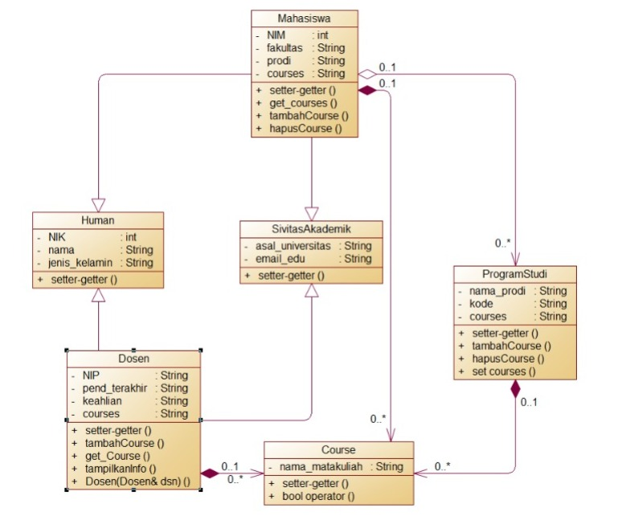

# LATIHAN4DPBO2023
## Janji
Saya Destira Lestari Saraswati NIM 2100506 mengerjakan soal Latihan 4
dalam mata kuliah Desain Pemrograman Berorientasi Objek untuk keberkahanNya
maka saya tidak melakukan kecurangan seperti yang telah dispesifikasikan.
Aamiin.

# Tugas LATIHAN4DPBO2023
Buatlah program berbasis OOP menggunakan bahasa pemrograman C++ dan Python  yang mengimplementasikan konsep inheritance, composition, dan array of object pada kelas-kelas tersebut:
Mahasiswa: NIM, nama, jenis_kelamin, fakultas, prodi
Human: NIK, nama, jenis_kelamin
SivitasAkademik: asal_universitas, email_edu
Dosen: NIP, nama, jenis_kelamin, fakultas, prodi, pend_terakhir, keahlian
Course: nama_matakuliah, 
Program Studi: nama_prodi, kode, course

File README berisi desain program, penjelasan alur, dan dokumentasi saat program dijalankan (screenshot/screen record, pilih salah satu bahasa sebagai contoh)

Submit link repository pada form berikut: [Form Pengumpulan]https://forms.gle/rvb1hKxbQVuYNbhKA  

## Desain Program
untuk program bahasa C++ dan Python
Desain yang saya buat menggunakan 6 Class:
* Human	
* SivitasAkademik
* Course
* Mahasiswa
* ProgramStudi	
* Dosen
Dengan tambahan file Main untuk menampilkan seluruh data mahasiswa; dicari berdasarkan `NIM` dan data dosen berdasarkan `NIP` termasuk `course` yang mereka miliki.

Atribut pada masing-masing kelas:
* 1.Kelas Human:
  - int _NIK; (integer)
  - std::string _nama; (string)
  - std::string _jenis_kelamin; (string)

* 2.Kelas SivitasAkademik:
  - std::string _asal_universitas; (string)
  - std::string _email_edu; (string)

* 3.Kelas Course:
  - std::string _nama_matakuliah; (string)

* 4.Kelas Mahasiswa (turunan dari kelas Human dan SivitasAkademik):
  - int _NIM; (integer)
  - std::string _fakultas; (string)
  - std::string _prodi; (string)
  - std::liststd::string _courses; (list of strings)

* 5.Kelas ProgramStudi:
  - std::string _nama_prodi; (string)
  - std::string _kode; (string)
  - std::list<Course> _courses; (list of Course objects)

* 6.Kelas Dosen (turunan dari kelas Human dan SivitasAkademik):
  - std::string _NIP; (string)
  - std::string _fakultas; (string)
  - std::string _prodi; (string)
  - std::string _pend_terakhir; (string)
  - std::string _keahlian; (string)
  - std::list<Course> _courses; (list of Course objects)

terdapat tambahan method untuk menambahkan course, menghapus, mengambil course, pembanding course(pengalih agar tidak redef).
`ralat pada diagram` tidak ada method tampilkaninfo(), menampilkan atribut dilakukan pada blok `main`
_Semua Class diatas dilengkapi dengan setter dan getternya_

`Hubungan Composition`

-Kelas Mahasiswa memiliki atribut _courses yang bertipe std::liststd::string, yang merepresentasikan daftar mata kuliah yang diambil oleh mahasiswa tersebut. Atribut ini adalah composition karena objek dari kelas Mahasiswa terdiri dari objek-objek mata kuliah yang diambilnya.

-Kelas ProgramStudi memiliki atribut _courses yang bertipe std::list<Course>, yang merepresentasikan daftar mata kuliah yang ada pada program studi tersebut. 

-Kelas Dosen memiliki atribut _courses yang bertipe std::list<Course>, yang merepresentasikan daftar mata kuliah yang diajarkan oleh dosen tersebut. Atribut ini juga adalah composition karena objek dari kelas Dosen terdiri dari objek-objek mata kuliah yang diajarkannya.

-Mahasiswa beragregasi dengan programstudi.
-Hubungan parent antara:
  -Human dengan Dosen dan Mahasiswa
  -SivitasAkademik dengan Mhasiswa dan Dosen
  
## Alur Program
-user memilih NIM yang pada pada daftar NIM yang disediakan
-jika NIM yang dipilih terdapat pada data maka akan ditampilkan semua identitasnya, termasuk course yang diikuti
-jika tidak program akan memberikan info kalau NIM yang dinputkan tidak ada
-program menampilkan daftar NIP dosen
-user memasukan NIP dosen
-jika sama akan tampil datanya jika tidak program akan memberi info
-program selesai

## Dokumentasi
**Program C++**

